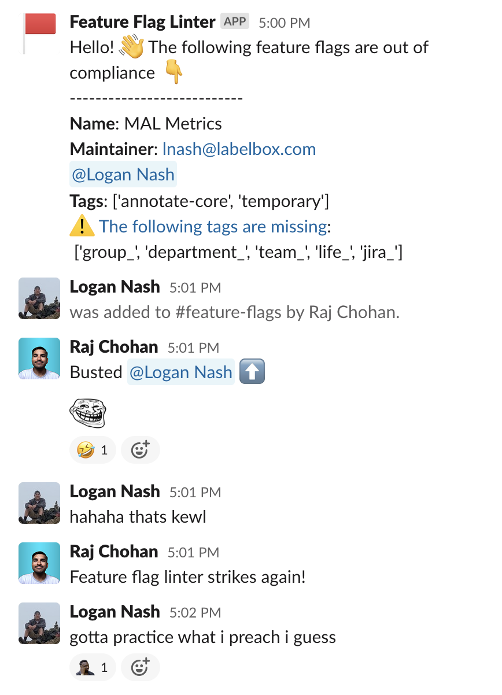

# Flag Linter



The code in this repository checks the compliance of feature flags with a given set of requirements.

To use the code, you will need to provide your own LaunchDarkly API key and Slack bot key in a .env file, using the following format:
```
LAUNCH_DARKLY_KEY=<your-launch-darkly-key>
SLACK_BOT_KEY=<your-slack-bot-key>
```

You will also need to provide the URL for the Slack channel where you want the results to be posted. This can be done by adding the following line to your .env file:
```
SLACK_CHANNEL_URL=<your-slack-channel-url>
```

Follow these instructions to get the URL: https://api.slack.com/messaging/webhooks

## Setup

For MacOS:
```
brew install virtualenv
virtualenv env
source env/bin/activate
pip install -U python-dotenv
pip install -U requests
```

## Run it
Once you have provided your API keys and Slack channel URL, you can run the code by using the following command:

```
python main.py
```

The code will make a request to the LaunchDarkly API to retrieve a list of all flags in the project, and then iterate over the list of flags to check their compliance. If a flag is not in compliance, the code will log information about the flag and increment a counter for the number of non-compliant flags.

After it has processed all flags, the code will log a summary of the results, and if there are any non-compliant flags, it will send a message to the specified Slack channel containing information about each non-compliant flag.

The specific requirements for flag compliance are determined by the code, and may be modified as needed.

# Setting up cron job
- crontab -e
- Add "0 0 * * 1-5 python3 /path/to/lb-flag-linter/main.py >> /path/to/flag_log.out 2>&1"
